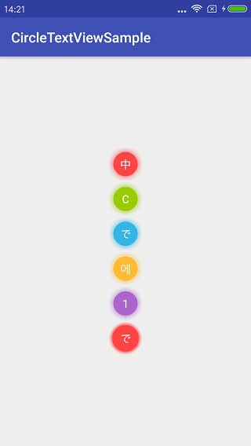
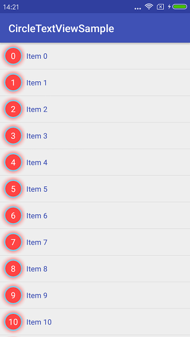

# CircleTextView
CircleTextView is an open source Android library that allows developers to easily create an circle TextView with colorful shadow.

### ScreenShot
<a href="screenshot/Demo01.png"></a> <a href="screenshot/Demo02.png"></a>

### Gradle
```groovy
dependencies {
    compile 'com.github.ShortStickBoy:Timer:V1.0.0'
}
```

### Use
```groovy
        <com.sunzn.ctv.library.CircleTextView
            android:layout_width="50dp"
            android:layout_height="50dp"
            android:gravity="center"
            android:text="C"
            android:textColor="@android:color/white"
            android:textSize="16sp"
            app:borderAlpha="0.5"
            app:borderColor="@android:color/holo_green_light"
            app:borderWidth="0"
            app:circleColor="@android:color/holo_green_light"
            app:shadowColor="@android:color/holo_green_light"
            app:shadowWidth="15" />
```

| Attribute   | Describe                               | Additional                                                        |
| ----------- | -------------------------------------- | ----------------------------------------------------------------- |
| circleColor | Color of center circle                 | Support color                                                     |
| borderColor | Color of middle circle                 | Support color                                                     |
| shadowColor | Color of outer shadow                  | Support color                                                     |
| borderWidth | Thickness of middle circle             | Support float, default value is 0.                                |
| shadowWidth | Thickness of outer shadow              | Support float, default value is 0.                                |
| circleAlpha | Alpha of center circle                 | Support float value from 0 to 1, default value is 1.              |
| borderAlpha | Alpha of middle circle                 | Support float value from 0 to 1, default value is 1.              |

### License
```
    Copyright [2017] sunzn

    Licensed under the Apache License, Version 2.0 (the "License");
    you may not use this file except in compliance with the License.
    You may obtain a copy of the License at

       http://www.apache.org/licenses/LICENSE-2.0

    Unless required by applicable law or agreed to in writing, software
    distributed under the License is distributed on an "AS IS" BASIS,
    WITHOUT WARRANTIES OR CONDITIONS OF ANY KIND, either express or implied.
    See the License for the specific language governing permissions and
    limitations under the License.
```